# Netflix Clone DevSecOps Project

A React + TypeScript Netflix-style web application delivered through a complete DevSecOps pipeline. The project demonstrates application build automation, static code analysis, quality gates, dependency vulnerability scanning, container image scanning, Docker image build/push, Kubernetes deployment preparation, and infrastructure monitoring with Prometheus/Grafana.

---

## Project Overview

This repository contains a Netflix clone frontend built with React, TypeScript, Vite, Material UI, Redux Toolkit, React Router, Framer Motion, Video.js, Docker, Jenkins, SonarQube, OWASP Dependency-Check, Trivy, Kubernetes, Prometheus, and Grafana.

The DevSecOps workflow focuses on:

- Building and validating the React application.
- Checking code quality using SonarQube.
- Enforcing a quality gate before continuing the pipeline.
- Scanning project dependencies using OWASP Dependency-Check.
- Scanning the filesystem and Docker image using Trivy.
- Building and pushing a Docker image.
- Preparing deployment through Docker/Kubernetes.
- Monitoring the server using Prometheus Node Exporter and Grafana.

---

## Technology Stack

| Area | Tools / Technologies |
|---|---|
| Frontend | React 18, TypeScript, Vite |
| UI | Material UI, Emotion, Framer Motion |
| State Management | Redux Toolkit, React Redux |
| Routing | React Router DOM |
| Media | Video.js, videojs-youtube |
| CI/CD | Jenkins, GitHub Actions |
| Code Quality | SonarQube, Sonar Scanner |
| Security Scanning | OWASP Dependency-Check, Trivy |
| Containerisation | Docker, Nginx |
| Deployment | Docker container, Kubernetes YAML manifests |
| Monitoring | Prometheus Node Exporter, Grafana |

---

## DevSecOps Pipeline Flow

```mermaid
flowchart LR
    A[Source Code] --> B[Checkout from Git]
    B --> C[SonarQube Analysis]
    C --> D[Quality Gate]
    D --> E[Install Dependencies]
    E --> F[OWASP Dependency-Check]
    F --> G[Trivy Filesystem Scan]
    G --> H[Docker Build & Push]
    H --> I[Trivy Image Scan]
    I --> J[Deploy to Container]
    J --> K[Kubernetes Deployment]
    K --> L[Prometheus & Grafana Monitoring]
```



---

## Repository Structure

```text
.
├── Dockerfile
├── Kubernetes/
│   ├── deployment.yml
│   ├── service.yml
│   └── node-service.yaml
├── pipeline.txt
├── package.json
├── public/
├── src/
│   ├── components/
│   ├── pages/
│   ├── providers/
│   ├── routes/
│   └── main.tsx
└── docs/
    └── images/
```

---

## Local Development Setup

### 1. Clone the repository

```bash
git clone <your-github-repository-url>
cd <your-repository-folder>
```

### 2. Install dependencies

```bash
npm install
```

### 3. Configure environment variables

Create a `.env` file from `.env.example` and add your TMDB API key:

```bash
VITE_APP_TMDB_V3_API_KEY=<your_tmdb_api_key>
VITE_APP_API_ENDPOINT_URL=https://api.themoviedb.org/3
```

### 4. Run the application locally

```bash
npm run dev
```

### 5. Build the application

```bash
npm run build
```

---

## Docker Build and Run

The Dockerfile uses a multi-stage build. The first stage builds the Vite application using Node.js, and the second stage serves the compiled files with Nginx.

```bash
docker build --build-arg TMDB_V3_API_KEY=<your_tmdb_api_key> -t netflix .
docker run -d -p 8081:80 netflix
```

Open the application in the browser:

```text
http://localhost:8081
```

---

## Jenkins Pipeline Summary

The Jenkins pipeline includes the following stages:

1. Clean workspace.
2. Checkout source code from GitHub.
3. Run SonarQube analysis.
4. Wait for SonarQube quality gate.
5. Install project dependencies.
6. Run OWASP Dependency-Check filesystem scan.
7. Run Trivy filesystem scan.
8. Build Docker image and push it to Docker Hub.
9. Run Trivy Docker image scan.
10. Deploy the image to a Docker container.
11. Deploy to Kubernetes.
12. Send an email notification with build logs and security scan reports.

---

## Kubernetes Deployment

The Kubernetes manifests define a deployment and NodePort service for the Netflix application.

```bash
kubectl apply -f Kubernetes/deployment.yml
kubectl apply -f Kubernetes/service.yml
```

The application service exposes port `80` using NodePort `30007`.

---

## Security and Quality Checks

### SonarQube

SonarQube is used to inspect code quality, bugs, vulnerabilities, code smells, duplications, and maintainability. The project dashboard shows the quality gate passing successfully.

### OWASP Dependency-Check

OWASP Dependency-Check scans project dependencies and reports known CVEs. The evidence below shows high, medium, and low severity findings from the dependency scan.

### Trivy

Trivy is used for two security checks:

- Filesystem scan: `trivy fs . > trivyfs.txt`
- Docker image scan: `trivy image <docker-image-name> > trivyimage.txt`

### Docker Registry Security

Docker image publishing requires a valid Jenkins credential configured for Docker Hub. One captured build failed because Docker login was unsuccessful, which prevented later Trivy image scanning and deployment stages from running.

---

## Monitoring

Prometheus Node Exporter is used to collect server metrics, and Grafana is used to visualise the infrastructure health. The dashboard tracks CPU, memory, disk, system load, root filesystem usage, RAM, swap, uptime, and node-level performance.

---

# Project Evidence and Screenshot Explanations

## 1. GitHub Actions Node.js 18 Build


This screenshot shows a GitHub Actions build running with Node.js 18.x. The workflow successfully checks out the repository, installs dependencies with `npm ci`, and starts the application. The log confirms that the application is running locally on port `3000`.

**Explanation:** This verifies that the React application can be installed and started in an automated CI environment. It is useful evidence that the project can run outside the developer machine.

---

## 2. JDK 17 / Maven Configuration Error


This screenshot shows a failed setup step where JDK 17 was configured and the workflow expected a Maven `pom.xml` file. The error says no `pom.xml` was found in the checked-out repository.

**Explanation:** The project is a React/TypeScript frontend, not a Maven Java project. This failure shows that the Java/Maven configuration was not required for this repository unless a separate Java backend is added. The CI configuration should focus on Node.js build commands for this project.

---

## 3. Early Jenkins Pipeline Failure at SonarQube Stage


This screenshot shows an earlier Jenkins pipeline run where the pipeline stopped at the SonarQube analysis stage. The next stages, such as quality gate and dependency installation, were not completed.

**Explanation:** This represents an early troubleshooting stage of the DevSecOps pipeline. It shows that SonarQube integration needed to be corrected before the pipeline could continue to the quality gate and security scanning stages.

---

## 4. Jenkins Quality Gate Running


This screenshot shows Jenkins build `#11` progressing through Tool Install, clean workspace, Git checkout, and SonarQube Analysis. The pipeline is waiting at the quality gate stage.

**Explanation:** The quality gate is an important DevSecOps control point. It ensures the pipeline checks SonarQube results before continuing to dependency installation, security scanning, Docker build, and deployment.

---

## 5. SonarQube Project Dashboard


This screenshot shows the SonarQube project named `Netflix` with a passed quality gate. The dashboard displays `0` bugs, `0` vulnerabilities, `18` code smells, `0.0%` coverage, `0.0%` duplications, and approximately `3.2k` lines of TypeScript code.

**Explanation:** This confirms that SonarQube analysis was successfully connected to the project and that the quality gate passed. It also highlights areas for improvement, especially test coverage, which is currently shown as `0.0%`.

---

## 6. Jenkins Pipeline Successful Through Install Dependencies


This screenshot shows Jenkins build `#12` completing Tool Install, clean workspace, Git checkout, SonarQube Analysis, quality gate, and Install Dependencies successfully.

**Explanation:** This demonstrates pipeline improvement after fixing the earlier SonarQube issue. At this stage, the CI/CD workflow successfully reached dependency installation, preparing it for security scanning and Docker build stages.

---

## 7. OWASP Dependency-Check Scan Stage


This screenshot shows the OWASP filesystem scan stage running in Jenkins. The dependency scan is invoked successfully, but Jenkins reports that it was unable to find Dependency-Check reports to parse.

**Explanation:** The scanner executed, but the report publishing pattern did not locate the expected XML report. This usually means the report output path or report format needs to match the Jenkins publisher pattern, such as `**/dependency-check-report.xml`.

---

## 8. Docker Build and Push Stage Failure


This screenshot shows the Docker Build & Push stage failing in Jenkins.

**Explanation:** The Docker stage is responsible for building the application image, tagging it, authenticating with Docker Hub, and pushing the image. A failure at this point prevents image scanning and deployment from continuing.

---

## 9. Full Jenkins Pipeline View with Docker Failure


This screenshot shows Jenkins build `#25`. The pipeline completes Tool Install, clean workspace, Git checkout, SonarQube Analysis, quality gate, Install Dependencies, OWASP FS Scan, and Trivy FS Scan. It then fails at Docker Build & Push, causing the later Trivy image scan and Deploy to container stages to be skipped.

**Explanation:** This image gives a full view of the DevSecOps flow and shows how Jenkins stops downstream stages when an important build or registry step fails.

---

## 10. OWASP Dependency-Check Results


This screenshot shows the OWASP Dependency-Check HTML report. The severity distribution includes high, medium, and low findings. Example affected packages shown include `brace-expansion`, `minimatch`, `postcss`, `rollup`, and `vite`.

**Explanation:** Dependency-Check helps identify vulnerable open-source packages in the application. These findings should be reviewed, prioritised by severity, and remediated by upgrading packages or applying recommended fixes.

---

## 11. Jenkins Console Log: Docker Login Failed


This screenshot shows the Jenkins console output after the Docker failure. The log confirms `ERROR: docker login failed`, and the Trivy image scan and Deploy to container stages were skipped because of the earlier failure.

**Explanation:** The root cause is Docker registry authentication. The Jenkins Docker credential should be checked to make sure the credential ID, username, password/access token, and Docker Hub permissions are correct.

---

## 12. Grafana Node Exporter Monitoring Dashboard


This screenshot shows a Grafana Node Exporter dashboard connected to a Prometheus datasource. It displays CPU, memory, disk, root filesystem usage, RAM, swap, uptime, and other node metrics.

**Explanation:** Monitoring is the final operational layer of the DevSecOps setup. Grafana provides visibility into server health after deployment, helping detect resource issues and performance problems.

---

## Key Learning Outcomes

- Built and containerised a React/TypeScript web application.
- Automated the delivery process using Jenkins and GitHub Actions.
- Integrated SonarQube for static code analysis and quality gates.
- Added OWASP Dependency-Check for dependency vulnerability reporting.
- Added Trivy for filesystem and image security scanning.
- Prepared Docker and Kubernetes deployment workflows.
- Set up monitoring visibility using Prometheus Node Exporter and Grafana.
- Troubleshot real pipeline failures, including Maven misconfiguration, Dependency-Check report publishing, and Docker registry login failure.

---

## Recommended Improvements

- Add unit tests and increase SonarQube code coverage above `0.0%`.
- Fix Dependency-Check report output so Jenkins can parse the XML report automatically.
- Replace hard-coded image names with Jenkins environment variables.
- Store all secrets in Jenkins credentials or GitHub Secrets.
- Use a Docker Hub access token instead of a password.
- Add branch protection and require successful quality/security checks before merging.
- Add Kubernetes readiness and liveness probes.
- Add automated rollback strategy for failed deployments.

---

## Author

**Uriel Djantou Fanja**

DevSecOps, Cloud, Network Infrastructure, and CI/CD Project
